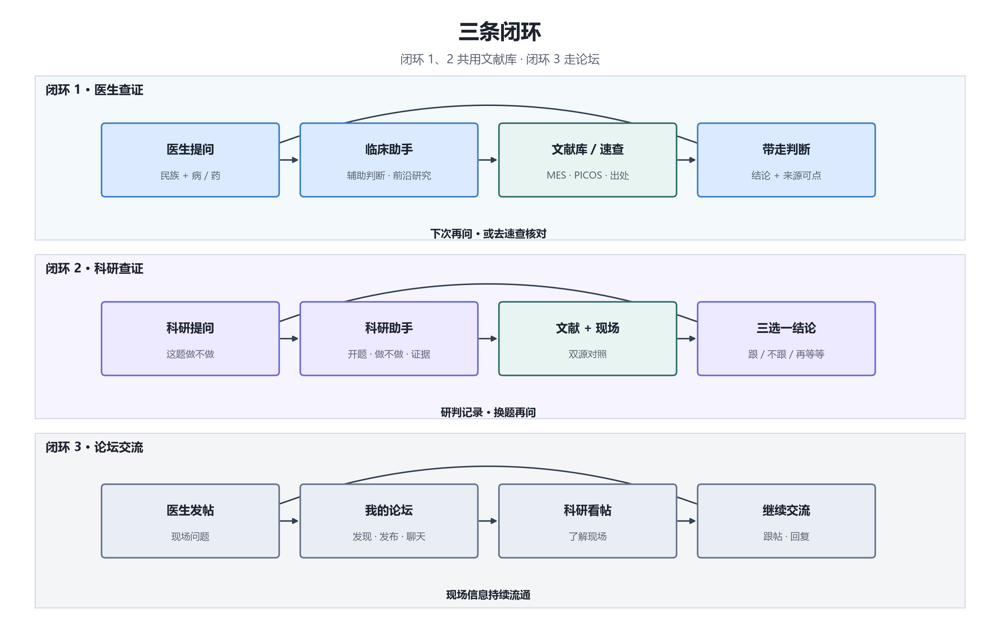
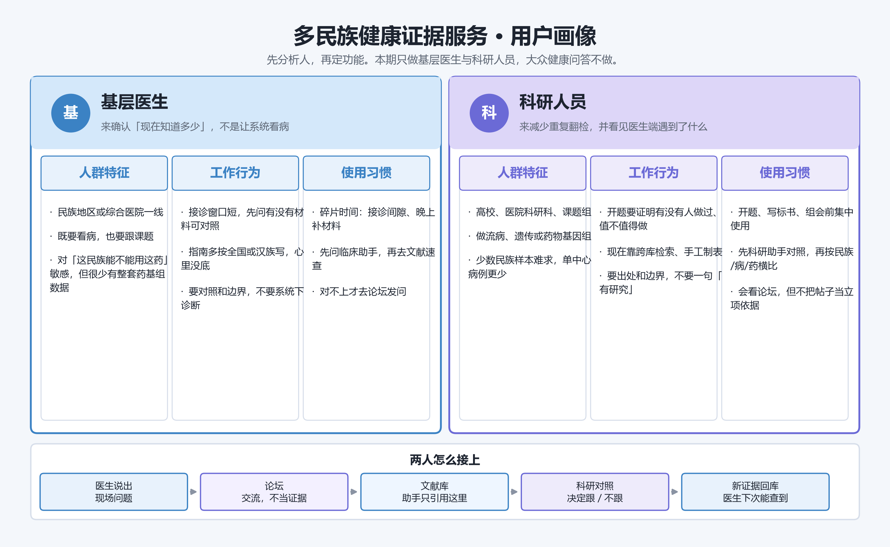
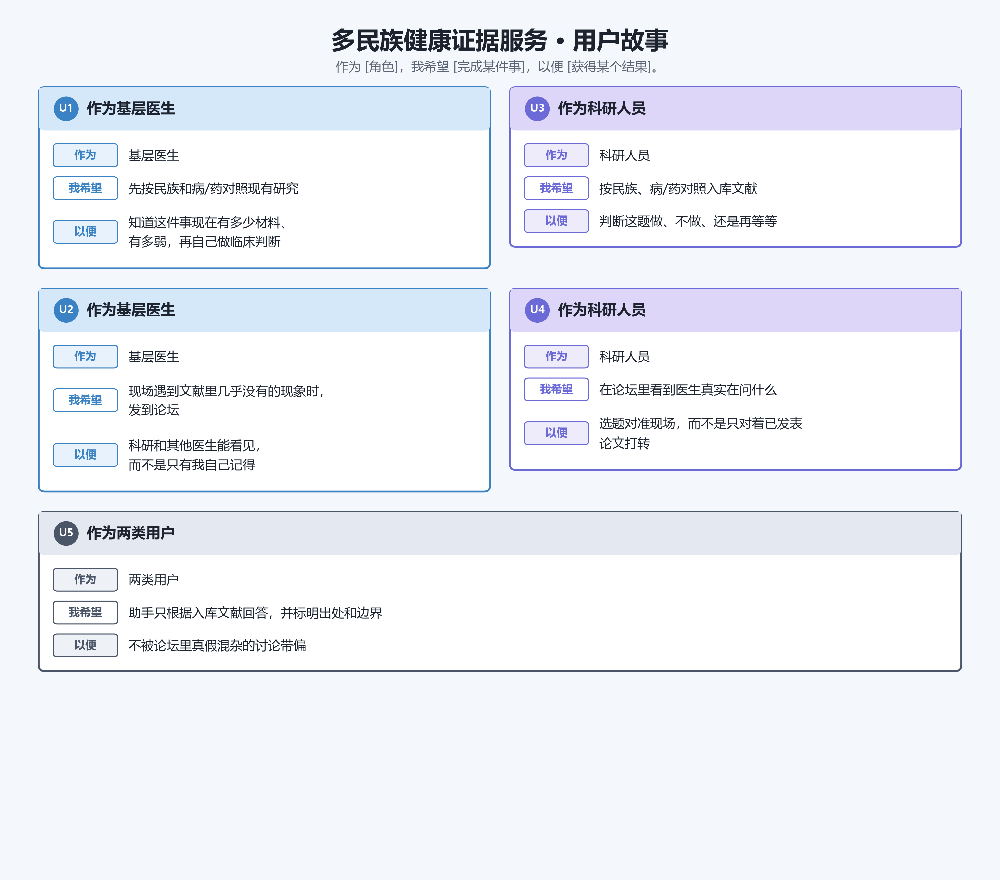
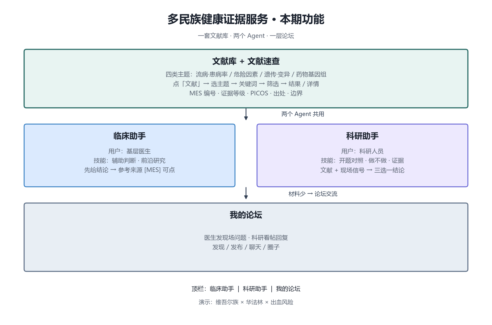
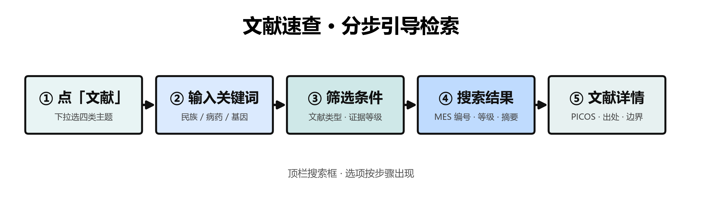
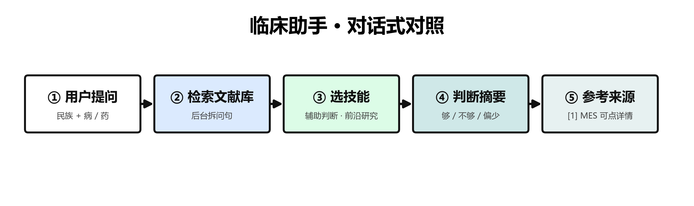
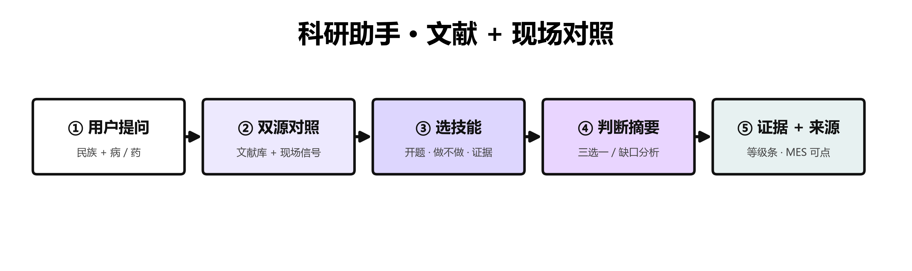
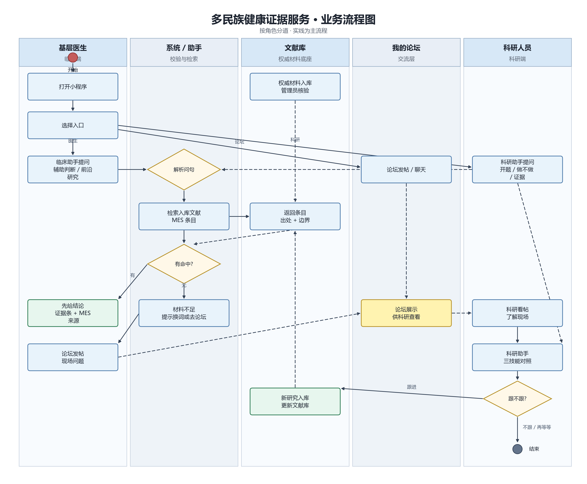
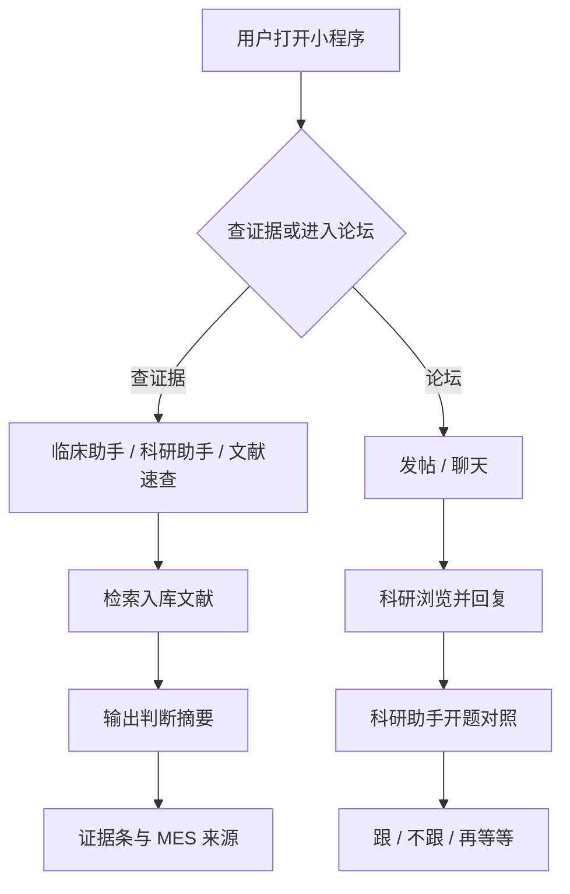

# PRD 产品需求文档

> 本期服务对象：基层医生、科研人员。

---

## 1. 文档信息

| 字段 | 内容 |
| --- | --- |
| 产品 / 模块 | 多民族健康证据服务（小程序） |
| 需求名称 | 文献底座 + 双助手 + 医研论坛 一期 |
| 负责人 | 待填 |
| 相关人员 | 产品、设计、前端、后端、测试 |
| 当前版本 | v0.8 |
| 创建日期 | 2026-08-30 |
| 预计上线 | 课程演示 / Demo |
| 状态 | 草稿 |
| 可交互原型 | `demo/dual-agent/index.html` |

---

## 2. 背景与目标

### 2.1 背景

本产品对应任务书「3. 多民族特色医学智能体」中面向科研人员与基层医生的证据服务方向。当前存在以下问题：

- 少数民族相关流行病学、群体遗传学与药物基因组学材料分散于各数据库，检索口径不一，难以快速对照。
- 医生在接诊窗口内，需要迅速了解「某一民族、某一疾病或药物，现有公开研究已知多少、证据强弱如何」，而非阅读长篇综述。
- 科研人员在开题阶段，需反复跨库检索与手工制表，以判断「某一题目是否已有研究基础、是否值得跟进」。
- 临床端观察到的现场现象，缺乏与科研端对接的结构化通道。

### 2.2 产品目标

本产品旨在**提高判断效率**：由 Agent 承担文献检索与结果整理，用户优先获取可带走的结论；条数、等级、出处等证据材料在用户需要时再行展开。

| 角色 | 核心产出 |
| --- | --- |
| 基层医生 | 接诊间隙带走一句判断：「现有材料知道多少 / 材料是否不足」 |
| 科研人员 | 开题前带走一句判断：「跟 / 不跟 / 再等等」 |

底层共用一套可追溯的入库文献库（MES 编号条目），两个 Agent 与文献速查均基于该库检索。

### 2.3 本期功能构成

本期交付由以下四部分构成：

1. **文献速查**：面向人工核对出处的分步引导检索能力。  
2. **临床助手 Agent**：面向医生的文献存量对照，含「辅助判断」「前沿研究」两项技能。  
3. **科研助手 Agent**：面向科研的选题对照，含「开题对照」「做不做研究」「证据」三项技能。  
4. **我的论坛**：医生与科研人员交流现场问题的独立模块。

### 2.4 三条业务闭环

系统业务围绕三条闭环组织，闭环 1、2 共用同一文献库，闭环 3 走论坛。

**闭环 1 · 医生查证**

医生以自然语言描述「民族 + 病/药」→ 临床助手检索入库文献并先给出判断摘要 → 如需逐条核对 PICOS 与出处，可点击文末 MES 来源或进入文献速查 → 医生带走对照结论。

**闭环 2 · 科研查证**

科研以自然语言描述选题 → 科研助手对照入库文献与临床端脱敏现场信号 → 先给出开题或立项参考结论 → 如需核对证据等级与设计类型，可使用「证据」技能或点击 MES 来源 → 科研带走「跟 / 不跟 / 再等等」类判断，并写入研判记录。

**闭环 3 · 论坛交流**

医生将现场问题发布至我的论坛 → 科研在论坛发现、浏览并回复 → 双方通过跟帖或聊天继续交流，为闭环 2 提供选题背景。

**演示验收题目**：维吾尔族 × 华法林 × 出血风险。在该题目下，临床助手可对照、文献速查可检索、科研助手可给出立项参考、论坛可完成一次发帖与回复。

### 2.5 成功指标（Demo 期）

| 指标 | 目标 | 统计口径 |
| --- | --- | --- |
| 医生先见结论 | 首句即为「够 / 不够 / 偏少」 | 演示题从提问到看见首句回复 |
| 科研先见结论 | 首句即为三选一立项参考 | 结论位于回复开头 |
| 证据可追溯 | 文末附可点击 MES 编号 | 点击可进入文献详情 |
| 证据数据一致 | 条数与等级来自本次命中条目 | 与入库字段一致 |
| 论坛通路 | 医生可发、科研可见并可回 | 发现 / 发布 / 聊天至少走通一条 |

---

## 3. 用户与场景

### 3.1 用户画像

#### 画像 A · 基层医生

医生多在民族地区或综合医院一线执业，接诊时间有限。其需求并非获取完整文献综述，而是在短时间内确认：针对当前所遇民族与病/药组合，公开研究是否已有可对照材料、材料强弱如何。典型使用路径为：先向临床助手提问，必要时进入文献速查核对出处，若材料不足则至论坛描述现场现象。

#### 画像 B · 科研人员

科研人员多处于开题、标书撰写或组会汇报阶段，需判断某一「民族 × 病/药」题目是否已有研究积累、临床端是否已有相关现场信号。典型使用路径为：先向科研助手提问获取对照结论，通过「证据」技能核对等级与设计，并在论坛中了解医生端正在讨论的问题。

#### 角色与入口

| 角色 | 使用频率 | 权限范围 | 核心诉求 |
| --- | --- | --- | --- |
| 基层医生 | 接诊相关时 | 临床助手、文献速查、论坛 | 先见对照结论；现场问题可发布 |
| 科研人员 | 开题、对照时 | 科研助手、文献速查、论坛 | 先见立项参考；了解临床现场 |
| 管理员 | 低频 | 文献入库、论坛管理 | 维护入库材料 |

### 3.2 用户故事

> 作为基层医生，我希望先听到现有研究知道多少，以便在接诊中形成对照判断，并在需要时核对原始出处。  
> 作为基层医生，我希望将文献中尚未覆盖的现场现象发布至论坛，以便科研与其他医生可见。  
> 作为科研人员，我希望先听到这题是否值得跟进，以便决定立项方向，并在需要时查看证据等级。  
> 作为科研人员，我希望在论坛中了解医生正在讨论的现场问题，以便选题更贴近实际。

### 3.3 核心场景

| 编号 | 场景 | 触发条件 | 用户动作 | 系统响应 | 期望结果 |
| --- | --- | --- | --- | --- | --- |
| S1 | 医生接诊对照 | 遇少见民族或药 | 临床助手输入民族 + 病/药 | 先给判断摘要；文末附 MES 来源 | 带走对照结论 |
| S2 | 医生查文献 | 需自行翻阅材料 | 文献速查分步检索 | 返回 MES 列表与详情 | 可查看 PICOS 与出处 |
| S3 | 医生留现场 | 材料不足或对不上 | 论坛发帖 | 帖子进入论坛模块 | 问题被科研看见 |
| S4 | 科研开题 | 准备新课题 | 科研助手选技能提问 | 对照结论 + 证据条 + 来源 | 形成立项参考 |
| S5 | 科研看现场 | 需了解临床动态 | 打开论坛 | 展示帖子与讨论 | 选题有现场依据 |
| S6 | 医研交流 | 文献尚未覆盖 | 发帖、回复、聊天 | 论坛内完成交互 | 信息在两端流通 |

---

## 4. 需求范围

本期建设范围如下：

| 模块 | 范围说明 |
| --- | --- |
| 文献库 | 示意数据；覆盖 prev / risk / geno / pgx 四类；条目含 MES 编号、证据等级、PICOS、出处、边界 |
| 文献速查 | 分步引导检索，详见 §5.1.1 |
| 临床助手 | 辅助判断、前沿研究，详见 §5.1.2 |
| 科研助手 | 开题对照、做不做研究、证据，详见 §5.1.3 |
| 我的论坛 | 发现、发布、聊天、圈子、我 |
| 账号与入口 | Demo 阶段同一账号可切换临床 / 科研顶栏入口 |

---

## 5. 方案说明

### 5.1 功能总览

小程序顶栏设三个入口：**临床助手 | 科研助手 | 我的论坛**。文献速查入口嵌入两个助手首页，便于在对照结论后跳转核对。

| 功能模块 | 服务对象 | 功能说明 |
| --- | --- | --- |
| 文献库 + 文献速查 | 两端共用 | 分步检索入库文献；列表展示 MES 编号与证据等级；详情展示 PICOS、结论、出处与适用边界 |
| 临床助手 Agent | 基层医生 | 技能：辅助判断、前沿研究；对话式输出判断摘要，文末附可点击 MES 来源 |
| 科研助手 Agent | 科研人员 | 技能：开题对照、做不做研究、证据；对照文献与现场信号，输出立项参考与证据条 |
| 我的论坛 | 两端共用 | 发现、发布、聊天；承载现场问题的发布与医研交流 |

**助手应答通则**

1. 用户以 1～2 句自然语言说明民族与病/药；若关键维度缺失，系统仅追问所缺项。  
2. Agent 在后台解析问句并按需映射 PICO 维度，仅在已入库文献范围内检索。  
3. 回复首段给出可带走的判断结论；条数、等级、出处等证据信息随技能展开或在文末以来源形式呈现。  
4. 证据相关数字须由本次命中的入库条目计算得出，保证与文献库字段一致。

#### 5.1.1 文献速查

文献速查面向需要自行翻阅原始材料的用户。界面以顶栏搜索框为主入口，检索选项按步骤逐步呈现，避免首屏信息过载。

| 步骤 | 用户操作 | 系统响应 |
| --- | --- | --- |
| 1 | 点击搜索框左侧「文献」 | 下拉展示四类主题：prev 流病·患病率 / risk 危险因素 / geno 遗传·变异 / pgx 药物基因组 |
| 2 | 选择一类主题 | 搜索框左侧显示已选主题，等待关键词输入 |
| 3 | 输入关键词 | 出现「筛选条件」入口 |
| 4 | 点击「筛选条件」（可选） | 展开文献类型（七类，可多选）与证据等级（中 / 低） |
| 5 | 回车或点击确定 | 展示命中列表：MES 编号、文献类型、证据等级、结论摘要 |
| 6 | 点击某一条目 | 进入详情页：PICOS、结论、出处、适用边界；支持复制出处与收藏 |

**检索逻辑**：命中条件为「所选主题 AND 所选文献类型 AND 关键词匹配（民族 / 主题词 / 结论字段）」。

**证据等级规则**：每条文献在入库时已按研究设计标注 L1–L9（GRADE 口径）。列表筛选中，「中」对应 L4–L5，「低」对应 L6–L8；等级为条目固有字段，非按命中条数推算。

**空态处理**：无命中时提示调整筛选或更换关键词；某主题下无条目时展示「还没有文献」说明。

#### 5.1.2 临床助手

临床助手首页即为对话界面。医生以自然语言描述民族与病/药，系统在入库文献范围内检索并生成对照答复。

| 技能 | 适用问题 | 答复要点 |
| --- | --- | --- |
| 辅助判断 | 该民族、该病/药，现有材料是否足以支撑临床对照 | 首句明确「够 / 不够 / 偏少」；随后说明材料类型、适用边界及研究设计概况 |
| 前沿研究 | 该方向在库内已有哪些研究、脉络如何 | 说明命中条数、主题分布与研究设计类型；答复范围限于库内已入库条目 |

**答复结构**

1. **判断摘要**：以 2～4 句自然语言呈现，首句直接给出结论。  
2. **参考来源**：摘要下方以脚注形式列出 `[1] MES-xxx`，点击可进入文献详情页查看 PICOS、出处与边界。

临床助手与文献速查的关系：助手负责给出结论与摘要；用户需逐条核对 PICOS 时，可点击 MES 来源或进入文献速查。

#### 5.1.3 科研助手

科研助手在检索入库文献的同时，对照临床端上报的脱敏现场信号。现场信号字段包括民族、病/药、现象描述、地区与时间，用于开题对照；**其计入选题分析，但不计入证据等级统计**。

| 技能 | 适用问题 | 答复要点 |
| --- | --- | --- |
| 开题对照 | 该题是否已有研究、缺口在何处 | 综合文献条数与现场信号笔数，给出对照结论 |
| 做不做研究 | 该题是否值得立项跟进 | 首句给出三选一参考：可以做成课题 / 已有积累、暂不必再开 / 现在还说不清 |
| 证据 | 发表材料的等级与设计是否足以支撑立项 | 展示 L1–L9 等级分布、研究设计类型及立项含义；现场信号单独标注为选题参考 |

**答复结构**

1. **判断摘要**：以自然语言呈现立项或对照结论。  
2. **证据条**：compact 形式展示入库条数、证据强弱、等级分布及现场信号笔数。  
3. **参考来源**：文末附可点击 MES 编号，便于核对 PICOS 与 GRADE 信息。

**对照原则**：当现场信号较多而入库文献较少时，该题更具探索价值；当文献已有一定覆盖而现场信号尚未积累时，宜优先消化已有材料后再决定是否立项。

### 5.2 业务流程

以下流程图描述用户从打开小程序到获得结论、或通过论坛完成交流的主路径。

### 5.3 页面与交互

| 页面 / 区域 | 内容组成 | 主要操作 |
| --- | --- | --- |
| 临床助手 | 问候语、技能栏、对话区、历史记录 | 选择辅助判断或前沿研究；输入提问；查看历史 |
| 科研助手 | 问候语、技能栏、对话区、研判记录 | 选择开题对照、做不做或证据；输入提问；查看研判记录 |
| 文献速查 | 顶栏搜索、主题选择、筛选面板、结果列表 | 分步完成检索；进入详情 |
| 文献详情 | MES 编号、PICOS、结论、出处、边界 | 复制出处；收藏 |
| 我的论坛 | 发现、发布、聊天、圈子、我 | 发帖；浏览；回复 |

助手首页采用「聊天框 + 技能按钮」布局：用户先点选技能，再以自然语言描述问题，答复直接出现在对话流中。

### 5.4 数据对象与数据流

| 对象 | 关键字段 | 说明 |
| --- | --- | --- |
| 文献条目 | mes_id、ethnicity、topic、shelf、doc_type、grade、picos、conclusion、source、boundary | 助手与速查的检索底座 |
| Agent 会话 | 角色、技能、消息列表、cite_ids | 绑定本次引用的文献 id |
| 现场信号 | 民族、病/药、现象、地区、时间 | 脱敏字段，供科研助手对照 |
| 论坛帖 | 作者、正文、时间 | 独立存储，供论坛模块使用 |

文献库向助手与文献速查提供只读检索；论坛数据独立存储，与文献库分库管理。

### 5.5 业务规则

| 编号 | 规则说明 |
| --- | --- |
| R1 | 助手答复仅引用已入库文献，出处以 MES 编号标识 |
| R2 | 助手首句须为判断结论，证据材料随技能或来源脚注展开 |
| R3 | 证据条数与等级须由本次命中条目计算，与入库字段一致 |
| R4 | 无命中条目时，系统明确提示材料不足 |
| R5 | 科研助手对照文献与现场信号两类材料，现场信号不计入证据等级 |
| R6 | 临床端与科研端共用同一套文献库 |
| R7 | 论坛帖子独立存储，供交流使用 |

---

## 6. 数据字段（Demo 期）

| 字段 | 类型 | 必填 | 说明 |
| --- | --- | --- | --- |
| mes_id | 文本 | 是 | 如 MES-PGx-001 |
| ethnicity | 文本 | 是 | 民族 / 人群 |
| topic | 文本 | 是 | 病 / 药 / 现象 |
| shelf | 枚举 | 是 | prev / risk / geno / pgx |
| doc_type | 枚举 | 推荐 | 七类文献类型 |
| grade | 枚举 | 推荐 | L1–L9 |
| picos | 对象 | 推荐 | P / I / C / O / S |
| conclusion | 文本 | 是 | 结论摘要 |
| source | 文本 | 是 | 出处 |
| boundary | 文本 | 是 | 适用边界 |

---

## 7. 验收标准

| 编号 | 验收项 | 操作步骤 | 预期结果 |
| --- | --- | --- | --- |
| A1 | 入口切换 | 顶栏切换临床 / 科研 / 论坛 | 三个入口均可正常进入 |
| A2 | 临床助手 | 选择辅助判断，输入民族 + 病/药 | 首句为够/不够/偏少；文末 MES 来源可点击 |
| A3 | 科研助手 | 选择做不做研究，输入民族 + 病/药 | 首句为三选一结论；含证据条与 MES 来源 |
| A4 | 证据技能 | 选择证据并提问 | 展示等级分布；现场信号标注为选题参考 |
| A5 | 文献速查 | 选 pgx → 输入「华法林」→ 检索 | 出现 MES 条目；详情含 PICOS 与出处 |
| A6 | 论坛通路 | 发布一条帖子 | 帖子出现在论坛发现页 |
| A7 | 空态 | 打开无结果或无历史页面 | 展示说明文案，不出现编造数据 |

---

## 8. 版本记录

| 日期 | 版本 | 修改人 | 说明 |
| --- | --- | --- | --- |
| 2026-08-30 | v0.1 | — | 初稿 |
| 2026-09-02 | v0.2 | 张鸣 | 三条闭环 |
| 2026-09-03 | v0.4 | 张鸣 | 文献速查分步流程与流程图 |
| 2026-09-03 | v0.5 | 张鸣 | 临床助手两技能与对话式答复 |
| 2026-09-03 | v0.6 | 张鸣 | 科研助手三技能与证据条 |
| 2026-09-04 | v0.7 | 张鸣 | 配图对齐现版功能 |
| 2026-09-04 | v0.8 | 张鸣 | 恢复书面化表述，补全用户、规则与验收章节 |
