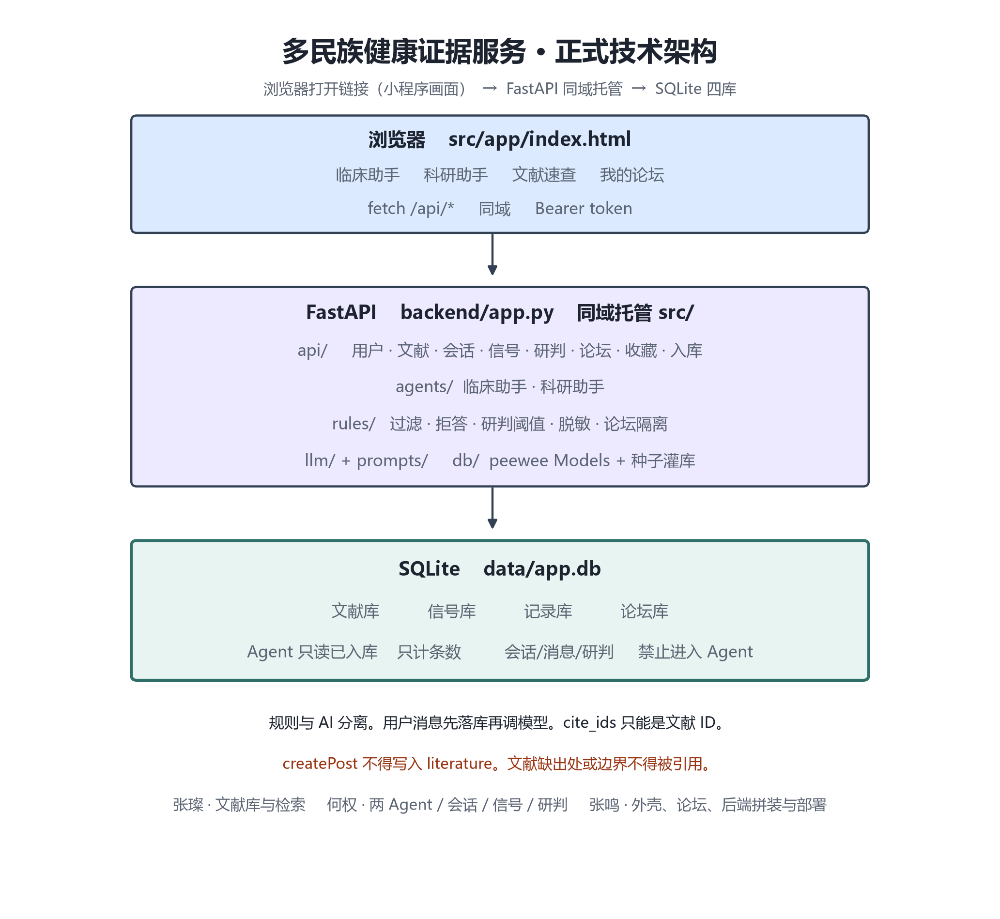
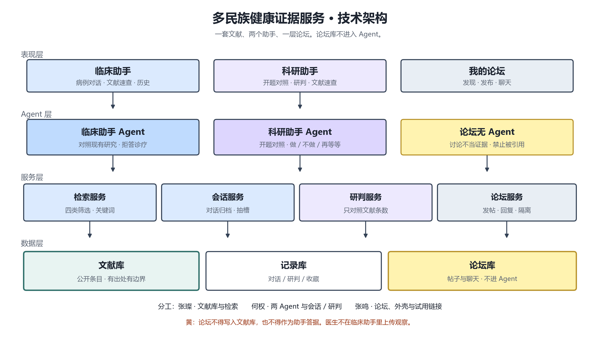
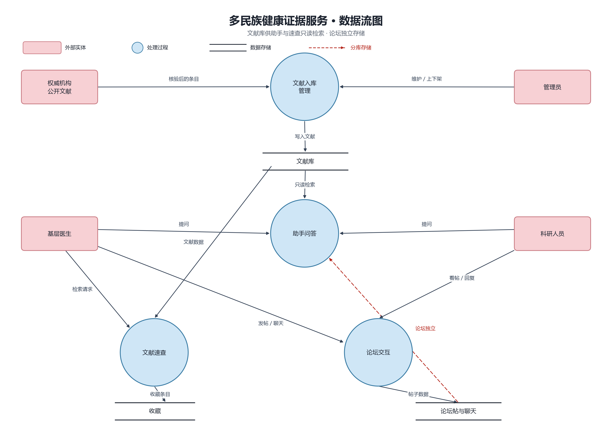
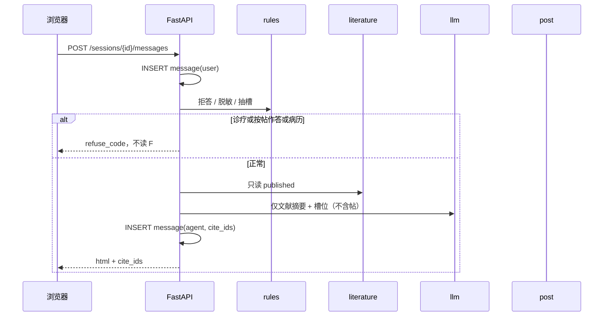

# 技术架构

| 项 | 内容 |
| --- | --- |
| 产品 | 多民族健康证据服务 |
| 客户端 | 浏览器打开链接，画面为小程序形态（非微信原生工程） |
| 版本 | v3.1（正式架构） |
| 日期 | 2026-08-30 |
| 负责人 | 张鸣 |
| 依据 | 《产品需求文档》v0.1 |
| 入口 | 前端：`src/app/index.html`（由 `backend/app.py` 同域托管） |
| 附图 | `docs/prd-assets/11-tech-stack.png`、`10-tech-architecture.png`、`09-data-flow.png` |

本文说明**正式实现**怎么分层、选型、模块、接口、数据流、库表、AI 与部署。产品给谁用、验收条目见需求文档。

---

## 1. 整体技术架构

```
浏览器（打开试用链接即进入小程序画面）
  ├── 临床助手     src/app + src/agents/clinic + src/literature
  ├── 科研助手     src/app + src/agents/research
  ├── 文献速查     src/literature
  └── 我的论坛     src/forum
        │  fetch /api/*
        │  Header  Authorization: Bearer <token>
        ▼
FastAPI（backend/app.py，同域托管静态前端）
  ├── api/          路由与鉴权
  ├── agents/       临床助手 / 科研助手
  ├── rules/        过滤、拒答、研判、脱敏、隔离
  ├── llm/ + prompts/
  └── db/           peewee Models + 种子灌库
        ▼
SQLite（data/app.db）
  文献库 | 记录库 | 论坛库
  （本期无「信号库 / 医生上传观察」。现场只进论坛。）
```



原则：

1. **规则与 AI 分离**：检索过滤、出处校验、诊疗红线、研判阈值、可识别信息拦截、论坛隔离用确定性规则；抽槽补全与对照表述用大模型。
2. **用户消息先落库再调模型**。模型失败不回滚已写消息；答复不得编造文献。
3. **一套文献、两端取用**：临床助手与科研助手不各建库，检索都落到已入库文献。
4. **三库隔离**：文献、记录、论坛分表。论坛只交流，禁止写回文献，也禁止进入 Agent 答据。`cite_ids` 只能是 `literature.id`。本期不做医生在助手里上传观察。
5. **可降级**：无 Key 或 `LLM_MOCK=1` 时走 mock；文献速查与点选仍能走完对照；Agent 返回 `degraded=true`，禁止改用论坛顶上。
6. **状态可读**：两端同读文献篇数、信号次数、研判记录；不以帖子热度、点赞数为据。

逻辑分层：



论坛在表现层有入口，**不经过 Agent 层检索文献作答**。科研人员可以打开论坛看帖；助手引用列表不得出现帖 ID。

---

## 2. 技术选型

| 层 | 选型 | 说明 |
| --- | --- | --- |
| 客户端 | HTML / CSS / JS | `src/`；手机框 + 顶栏 + 胶囊，看起来像小程序；无独立构建 |
| 语言 | Python 3.10+（镜像 3.12） | 与 Agent 一致 |
| 后端 | FastAPI + Uvicorn | REST JSON；同域挂静态前端 |
| ORM / 库 | peewee + SQLite | 演示与一期规模；JSON 用 Text；默认 `data/app.db` |
| 鉴权 | Header Bearer（token 简化为用户 id） | `api/deps.py` → `get_current_user`；角色 `doctor` / `researcher` / `admin` |
| LLM | OpenAI 兼容 HTTP | 默认 DeepSeek；可换 Groq 等；`LLM_MOCK=1` 走本地 mock |
| 对象存储 | 一期不做 | 文献以元数据入库，不存 PDF 原文 |
| 部署 | Docker + Render（或同等） | 单服务 API + 前端；打开链接即见小程序画面 |

选型理由：与上一套课程项目同一交付方式（浏览器打开链接）。不做微信原生小程序工程（无 `miniprogram/`、无开发者工具、无 request 合法域名）。画面按小程序做，便于以后若要迁微信只换壳。

---

## 3. 系统模块

| 编号 | 模块 | 职责 | 代码 | 负责人 |
| --- | --- | --- | --- | --- |
| M1 | 用户与权限 | 登录、角色切换、`/me`、鉴权 | `api/user.py`、`api/deps.py` | 张鸣 |
| M2 | 文献检索 | 四类分类、关键词、详情、空态 | `api/literature.py` | 张璨 |
| M3 | 收藏 / 知识库 | 按四类浏览本人收藏 | `api/favorite.py` | 张璨（页）+ 张鸣（入口） |
| M4 | 会话与对话 | 创建/结束/列表；发消息、历史 | `api/session.py`、`api/chat.py` | 何权 |
| M5 | 信号 | 脱敏校验、写入、按题汇总 | `api/signal.py`、`rules/privacy.py` | 何权 |
| M6 | 临床助手 | 对照现有研究；拒答诊疗；拒引用帖 | `agents/clinic_agent.py` | 何权 |
| M7 | 研判 | 文献篇数 × 信号次数 → 跟 / 不跟 / 再等等 | `api/judge.py`、`rules/judge.py` | 何权 |
| M8 | 科研助手 | 开题对照、做不做；不替代立项 | `agents/research_agent.py` | 何权 |
| M9 | 论坛 | 发现、发布、回复、聊天、圈子、我 | `api/forum.py` | 张鸣 |
| M10 | 运行与健康 | `/health`、日志、配置 | `backend/app.py` | 张鸣 |
| M11 | 文献入库 | 管理员新建/上下架；核验出处与边界 | `api/literature_admin.py`、`db/init_data.py` | 张璨（字段）+ 张鸣（权限） |

主链：`M1 → M2 → M4 → M6 → M5 → M8 / M7`。  
交流支链：`M9`（不回写 M2，不进入 M6 / M8）。  
管理支链：`M1(admin) → M11 → M2`。

### 3.1 模块输入 / 输出

**M2 检索**

| 能力 | 输入 | 输出 |
| --- | --- | --- |
| 分类浏览 | `shelf`、民族或主题 | 分组篇数或条目列表 |
| 详情 | 文献 ID | 摘要、范围、边界、出处；`status=published` |
| 关键词 | `q` | 过滤后的已入库条目；无则空列表 |

**M4 / M5 / M6**

| 能力 | 输入 | 输出 |
| --- | --- | --- |
| 临床提问 | 民族 + 病/药/现象 | `{ html, cite_ids, degraded }`；或材料不足 |
| 拒答 | 求医嘱 / 用帖子作答 / 可识别病历 | `refuse_code`，不检索论坛库 |
| 提交信号 | 五字段且通过脱敏 | 信号库 +1；文献行不变 |

**M7 / M8**

| 能力 | 输入 | 输出 |
| --- | --- | --- |
| 开题对照 | 民族 × 主题 | 文献篇数、信号次数、`rank`、边界声明 |

**M9**

| 能力 | 输入 | 输出 |
| --- | --- | --- |
| 发帖 / 回复 / 聊天 | 正文 | 只写入论坛表；Agent 查询接口不返回这些 ID |
| 发现 / 圈子 | 筛选 | 展示讨论 |

**M11**

| 能力 | 输入 | 输出 |
| --- | --- | --- |
| 发布文献 | 完整字段 + 出处 + 边界 | `status=published`，此后可被检索与引用 |
| 下架 | 文献 ID | `status=offline`，助手不可再引 |

---

## 4. 核心接口

统一前缀：`/api`。统一响应：

```json
{ "ok": true, "data": {}, "error": null }
{ "ok": false, "data": null, "error": { "code": "REFUSE_CLINIC", "message": "..." } }
```

鉴权：除 `/health`、`POST /users/login`、静态前端外，均需 `Authorization: Bearer <token>`。

### 4.1 路由索引

| 模块 | 文件 | 方法与路径 |
| --- | --- | --- |
| M10 | `app.py` | `GET /health` |
| M1 | `api/user.py` | `POST /users/login`、`GET /users/me` |
| M2 | `api/literature.py` | `GET /literature`、`GET /literature/shelves`、`GET /literature/{id}` |
| M11 | `api/literature_admin.py` | `POST /admin/literature`、`PATCH /admin/literature/{id}`、`POST .../publish`、`POST .../offline` |
| M3 | `api/favorite.py` | `GET /favorites`、`POST /favorites`、`DELETE /favorites/{literature_id}` |
| M4 | `api/session.py` | `POST /sessions`、`GET /sessions`、`GET /sessions/{id}`、`POST /sessions/{id}/end` |
| M4 | `api/chat.py` | `POST /sessions/{id}/messages`、`GET /sessions/{id}/messages` |
| M5 | `api/signal.py` | `POST /signals`、`GET /signals/summary`、`GET /signals` |
| M7 | `api/judge.py` | `GET /judge`、`POST /judge/reports`、`GET /judge/records` |
| M9 | `api/forum.py` | `GET/POST /posts`、`GET /posts/{id}`、`POST /posts/{id}/replies`、`GET /circles`、`GET/POST /chats`、`POST /chats/{id}/messages` |

M6 / M8 不单独暴露「自由生成」接口，只由 `POST /sessions/{id}/messages` 按会话 `agent` 字段调度。

### 4.2 请求 / 响应形状

**登录**

```
POST /users/login
body: { username, password }     # 演示账号可切换医生 / 科研 / 管理员
data: { token, user: { id, role, name } }
```

**文献**

```
GET /literature?ethnicity=&topic=&shelf=&q=&page=1&size=20
data: { items: Literature[], total }

GET /literature/{id}
data: Literature

Literature:
  id, ethnicity, topic, kind, shelf, rec, rec_title,
  conclusion, scope, boundary, source, status
```

仅返回 `status=published`。缺 `source` 或 `boundary` 的行不得出现在 Agent 检索结果中。

**会话与助手**

```
POST /sessions
body: { agent: "clinic" | "research" }
data: { id, agent, status: "open" }

POST /sessions/{id}/messages
body: { text }
data: {
  message_id,
  html,
  cite_ids: number[],      # 仅 literature.id
  refuse_code: null | "CLINIC" | "FORUM_CITE" | "PHI",
  rank: null | "跟" | "不跟" | "再等等",   # 仅科研会话
  degraded: boolean
}
```

服务端逻辑名（与路由等价，供规则测试）：

```
parseAsk(text) → { ethnicity, topic, phen }
answerClinic(text) → { html, cite_ids, refuse_code, degraded }
answerResearch(text) → { html, cite_ids, rank, refuse_code, degraded }
```

**信号**

```
POST /signals
body: { ethnicity, topic, phen, region, time }
data: { id }

GET /signals/summary?ethnicity=&topic=
data: { n, lit }
```

**论坛（Agent 进程禁止调用）**

```
POST /posts
body: { body, circle_id? }
data: { id }               # 不得写入 literature

GET /posts
data: { items: Post[] }
```

### 4.3 约定

1. 医生默认进临床助手，科研默认进科研助手；同一链接内可按角色切换，权限见需求文档 5.6。
2. `answerClinic` / `answerResearch` **不得** 查询 `post` / `reply` / `chat_message`。
3. `createPost` **不得** 插入或更新 `literature`。
4. 学生（医生/科研）不能调 `/admin/*`。
5. 练习与正式同一套已入库文献；上传信号不改文献行。
6. 错误码：`UNAUTHENTICATED`、`FORBIDDEN`、`REFUSE_CLINIC`、`REFUSE_FORUM_CITE`、`REFUSE_PHI`、`LIT_NOT_FOUND`、`SESSION_CLOSED`、`VALIDATION`。

### 4.4 最短联调

```
POST /users/login
  → POST /sessions { agent: clinic }
  → POST .../messages  「维吾尔族 华法林 出血」
  → GET /literature?ethnicity=维吾尔族&topic=华法林
  → POST /signals  或  POST /posts
  → POST /sessions { agent: research }
  → POST .../messages  「这题做不做」
  → POST .../messages  「按帖子回答」  → refuse_code=FORUM_CITE，且无对 /posts 的查询
```

---

## 5. 数据流转



硬规则：用户消息先写 `message`，再调助手；模型失败不回滚已写消息。论坛写入只进论坛表。Agent 编排路径上 **没有** 读帖步骤。



### 5.1 临床对照

登录（医生）→ `POST /sessions`（clinic）→ 写用户消息 → 规则抽槽 → 检索已入库文献 → 临床助手组答复并绑定 `cite_ids` → 可选 `POST /signals` → 会话可 `end` 写入历史。问诊疗则规则拦截。

### 5.2 科研研判

登录（科研）→ 科研会话 → 读文献篇数 + `GET /signals/summary` → `rules/judge.py` 给出 `rank` → LLM 补边界说明 → 写 `judge_record`。科研可打开论坛；助手 `cite_ids` 不得含帖 ID。

### 5.3 论坛

发帖 / 回复 / 聊天 → 只写论坛表 → 发现页展示。禁止：帖子同步进文献、用帖关键词冒充文献命中、把点赞当现场信号。

### 5.4 文献入库

管理员提交条目 → 校验出处与边界 → `published` → 检索与 Agent 可见。下架后不可再引。权威机构材料只经本流程进入文献库，不爬论坛。

### 5.5 研判阈值

写在 `rules/judge.py`，禁止散落在提示词里。

| 条件 | `rank` |
| --- | --- |
| 信号 ≥3 且文献 ≤2 | 跟 |
| 信号 ≥3 且文献 >2 | 不跟 |
| 信号 ≥2 且文献 =0 | 跟（可以留意） |
| 其余 | 再等等 |

有效对照口径：文献用 `id / source / boundary`；信号只用次数 `n`。原始文献行永不被信号或帖子覆盖。

---

## 6. 数据库与存储

- 引擎：SQLite，路径 `data/app.db`（环境变量 `DATABASE_PATH`）。
- ORM：peewee，模型在 `db/models.py`。JSON 数组（如 `cite_ids`）存 Text。
- 启动：`db.connect()`；空库执行 `seed_full_data()`（演示题：维吾尔族 × 华法林 × 出血风险）。
- 文献运行期：Agent 与检索 **只读** `status=published` 且 `source`、`boundary` 非空。

### 6.1 隔离

1. 四套存储，禁止用信号或帖子 UPDATE 文献字段。
2. 信号仅五字段：民族、药或病、现象、大致地区、时间。
3. Agent 引用只能是文献 ID。
4. 论坛表与 Agent 查询无 JOIN、无外键互指。

### 6.2 表结构

**user**

| 字段 | 类型 | 说明 |
| --- | --- | --- |
| id | INTEGER PK | |
| username | VARCHAR UNIQUE | 登录名 |
| password_hash | VARCHAR | |
| role | VARCHAR | `doctor` / `researcher` / `admin` |
| name | VARCHAR | 展示名 |
| created_at | DATETIME | |

**literature**

| 字段 | 类型 | 说明 |
| --- | --- | --- |
| id | INTEGER PK | 助手 `cite_ids` 只引用此列 |
| ethnicity | VARCHAR | 民族 |
| topic | VARCHAR | 病/药/现象 |
| kind | VARCHAR | 如 药 / 病 |
| shelf | VARCHAR | `prev` / `risk` / `geno` / `pgx` |
| rec | VARCHAR | 记录编号 |
| rec_title | VARCHAR | 题名 |
| conclusion | TEXT | 结论摘要 |
| scope | TEXT | 样本/范围 |
| boundary | TEXT | 适用边界，必填方可发布 |
| source | TEXT | 出处，必填方可发布 |
| status | VARCHAR | `pending` / `published` / `offline` |
| created_by | INTEGER FK user | |
| created_at, updated_at | DATETIME | |

索引：`(ethnicity, topic)`、`(shelf, status)`。

**favorite**：`id`，`user_id`，`literature_id`，`created_at`；UNIQUE(user_id, literature_id)。

**session**

| 字段 | 类型 | 说明 |
| --- | --- | --- |
| id | INTEGER PK | |
| user_id | INTEGER FK | |
| agent | VARCHAR | `clinic` / `research` |
| status | VARCHAR | `open` / `closed` |
| ethnicity, topic | VARCHAR NULL | 抽槽缓存 |
| lit_count | INTEGER | |
| uploaded | BOOLEAN | 是否已交信号 |
| created_at, ended_at | DATETIME | |

**message**：`id`，`session_id`，`sender`（`user`/`agent`），`text`，`html`，`cite_ids`（Text JSON），`refuse_code`，`degraded`，`created_at`。

**signal**：`id`，`user_id`，`ethnicity`，`topic`，`phen`，`region`，`time`，`created_at`。不含姓名、证件、住院号。短时重复提交由规则去重，不叠次。

**judge_record**：`id`，`user_id`，`session_id`，`ethnicity`，`topic`，`rank`，`signal_count`，`lit_count`，`summary`，`degraded`，`created_at`。

**circle**：`id`，`name`，`topic`。

**post**：`id`，`user_id`，`circle_id` NULL，`body`，`status`（`published`/`deleted`），`created_at`。无指向 literature 的外键。

**reply**：`id`，`post_id`，`user_id`，`body`，`created_at`。

**chat_thread**：`id`，参与双方 user_id，`created_at`。

**chat_message**：`id`，`thread_id`，`user_id`，`body`，`created_at`。

`shelf`：`prev` 流病·患病率 / `risk` 流病·危险因素 / `geno` 遗传·变异 / `pgx` 药物基因组。

### 6.3 权限与数据可见

| 角色 | 文献 | 信号 | 会话 | 论坛 | 入库 |
| --- | --- | --- | --- | --- | --- |
| doctor | 只读 published | 写；读自己明细 | 本人 clinic | 读发 | 否 |
| researcher | 只读 published | 读汇总（及规则允许的列表） | 本人 research | 读发 | 否 |
| admin | 读写含 pending | 读 | 不看进行中私聊细节（一期可不提供） | 删帖 | 是 |

---

## 7. AI 技术方案

| 组件 | 要点 |
| --- | --- |
| 调用层 | `llm/client.py`；`LLM_API_KEY` / `LLM_BASE_URL` / `LLM_MODEL` / `LLM_MOCK` |
| 临床 | `prompts/clinic.txt`；上下文 = 槽位 + 检索到的文献摘要；禁止诊断/处方/剂量 |
| 科研 | `prompts/research.txt`；上下文 = 篇数 + 信号次数 + 文献摘要；不批准立项、不给伦理结论 |
| 抽槽 | `rules/parse.py` 关键词优先；LLM 只补全；空槽不得编造民族或病名 |
| 拒答 | `rules/refuse.py`：诊疗、按帖作答、PHI → 直接返回，不检索论坛、不调 LLM |
| 研判 | `rules/judge.py` 算 `rank`；LLM 只写边界说明；失败 `degraded=true` |
| Mock | 无 Key 或 `LLM_MOCK=1`：模板答复，仍绑定真实 `cite_ids` |

编排：

```
INSERT message(user)
  → refuse / PHI
  → parseAsk
  → search literature (published only)
  → clinic 组对照 或 research 规则 rank
  → LLM 补评（可选）
  → INSERT message(agent)
```

人机边界：AI 只做对照表述。临床判断和是否立项由用户完成。论坛正文、聊天记录 **不得** 进入 `messages` 发给模型。

---

## 8. 部署和运行方式

### 8.1 本地

```bash
pip install -r requirements.txt
# .env：LLM_API_KEY、LLM_BASE_URL、LLM_MODEL、LLM_MOCK、DATABASE_PATH、JWT_SECRET
uvicorn backend.app:app --host 127.0.0.1 --port 8000
```

打开 `http://127.0.0.1:8000/`（API 与前端同域；根路径即小程序画面）。  
`GET /health` 返回 `{ "ok": true }`。

无后端时仅预览界面：仓库根目录 `py -3 -m http.server 8766`，打开 `http://127.0.0.1:8766/src/app/`。

### 8.2 Docker / Render

1. 镜像：`Dockerfile`（Python 3.12-slim，启动 uvicorn，托管 `src/`）。
2. Render Blueprint（或同等）部署单服务；Environment 填 LLM 变量。
3. 试用方式：把链接发给老师，浏览器打开即是小程序画面。不需要微信、不需要开发者工具。
4. 无持久盘时重启可能清空 SQLite，演示需挂卷或接受种子重建。
5. 免费实例可能冷启动；超时不得展示半截「确定结论」。

环境变量：

| 变量 | 说明 |
| --- | --- |
| `LLM_API_KEY` | 空则 mock |
| `LLM_BASE_URL` | OpenAI 兼容 |
| `LLM_MODEL` | 模型名 |
| `LLM_MOCK` | `1` 强制 mock |
| `DATABASE_PATH` | 默认 `data/app.db` |
| `JWT_SECRET` | 签发 Bearer |

演示账号随 `db/init_data.py` 种子（医生 / 科研 / 管理员）。

### 8.3 工程目录

```
Multicultural Medicine A/
├── src/                         静态前端：小程序画面（张鸣：壳；各目录按人）
│   ├── app/                     张鸣  index.html 顶栏/路由
│   ├── literature/              张璨
│   ├── agents/                  何权
│   ├── forum/                   张鸣
│   └── shared/                  张鸣守接口
├── backend/
│   ├── app.py                   同域挂 src/ + 路由
│   ├── api/
│   │   ├── deps.py              张鸣
│   │   ├── user.py              张鸣
│   │   ├── literature.py        张璨
│   │   ├── literature_admin.py  张鸣权限 + 张璨字段
│   │   ├── favorite.py          张璨
│   │   ├── session.py           何权
│   │   ├── chat.py              何权
│   │   ├── signal.py            何权
│   │   ├── judge.py             何权
│   │   └── forum.py             张鸣
│   ├── agents/
│   │   ├── clinic_agent.py      何权
│   │   └── research_agent.py    何权
│   ├── rules/
│   │   ├── parse.py             何权
│   │   ├── refuse.py            何权
│   │   ├── judge.py             何权
│   │   ├── privacy.py           何权
│   │   └── isolate.py           张鸣
│   ├── llm/client.py            何权
│   ├── prompts/                 clinic.txt / research.txt  何权
│   └── db/                      models.py、init_data.py
├── data/                        app.db（运行生成）
├── deploy/                      试用链接说明
├── demo/                        旧单页对照，只读
├── docs/
├── requirements.txt
├── Dockerfile
└── render.yaml
```

没有 `miniprogram/`。不做微信原生工程。

| 人 | 负责 | 禁止 |
| --- | --- | --- |
| 张璨 | 文献字段、检索 API、种子条目、速查页 | 改 Agent 提示词、论坛写入文献 |
| 何权 | 会话、消息、两 Agent、拒答、信号、研判 | 读论坛表作答、改文献口径 |
| 张鸣 | 外壳、登录、论坛、隔离、同域托管与 Render | 改文献条目内容、改是否引用论坛 |

---

## 9. 非功能

| 要求 | 做法 |
| --- | --- |
| 隔离 | 四库分存；Agent 代码路径不 import 论坛查询 |
| 合规 | 上传与发帖过 `privacy.py`；回复带「不得作为医嘱」；不采集病历 |
| 可降级 | mock 与速查可用；第三方失败返回「文献库暂不可用」，禁用论坛顶替 |
| 可追溯 | 消息、信号、研判、帖子均有 ID 与时间 |
| 安全 | HTTPS、Bearer、角色鉴权、管理接口与用户接口分离 |
| 体验 | 小程序形态（手机框、胶囊、顶栏三入口）；列表空态；超时不展示假结论 |
| 性能 | 检索分页；一期 SQLite 单实例，文献千级以内 |

---

## 10. 风险与止损

| 风险 | 应对 |
| --- | --- |
| 助手编造文献 | 只引用库内 ID；无命中明说不足；单测断言 `cite_ids` 子集 |
| 论坛/信号污染文献 | 写入函数分家；`isolate.py` 禁止 Agent 访问帖表 |
| 把弱证据当医嘱 | `REFUSE_CLINIC` + 强制边界文案 |
| Render 冷启动 / 链接打不开 | 提交说明写清链接；演示前先热一次实例 |
| SQLite 并发与丢库 | 演示单实例；云上挂持久盘 |
| 无 Key 现场失败 | 默认可 mock，演示脚本走规则模板 + 真实种子文献 |

---

## 11. 修订记录

| 版本 | 日期 | 说明 |
| --- | --- | --- |
| v1.x | 2026-08-28 | 双端、两 Agent、分库 |
| v2.0 | 2026-08-30 | 按 FastAPI 体例起草，仍夹杂 Web Demo |
| v3.0 | 2026-08-30 | 曾按微信原生小程序起草 |
| v3.1 | 2026-08-30 | 去掉 `miniprogram/`：浏览器打开链接即小程序画面；FastAPI 同域托管 `src/`；部署同 Render |

---

*文档结束。*
